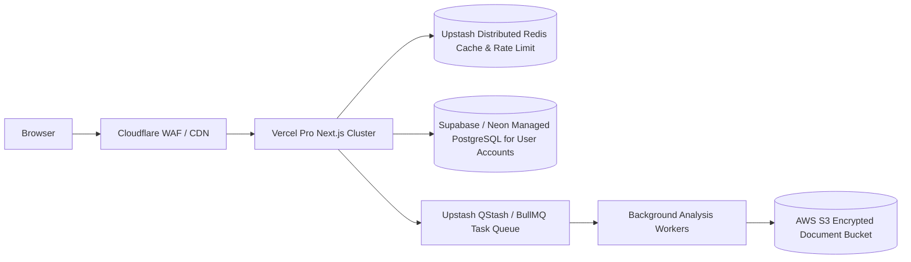

# RoleFit AI — AI Resume × Job Description Analyzer

> **Privacy-conscious, 100% explainable AI resume match scoring engine built as a single Next.js full-stack application with ₹0 infrastructure cost.**


---

## 🚀 Key Highlights & Architectural Decisions

* **Single Next.js Full-Stack Application**: No Express, NestJS, microservice, or separate backend repository. Frontend UI, Node.js Route Handlers, document parsers, scoring calculations, and AI requests reside in one unified Next.js 15 App Router app.
* **₹0 Infrastructure Cost**: Deployable on Vercel's free tier (`*.vercel.app`). No paid PostgreSQL, MongoDB, Redis, object storage, CDN, or backend hosting required.
* **Deterministic + AI Hybrid Engine**: The match score (0-100) is **100% deterministic** and fully explainable based on weighted required skills, experience duration, preferred skills, responsibilities, projects, and education. Google Gemini (`@google/generative-ai`) acts purely as a contextual recommendation layer.
* **Offline-First Fallback**: If AI is disabled, times out, or rate-limited, the deterministic engine returns complete scores, skill gaps, and rule-based recommendations without failing.
* **Privacy & PII Redaction**: Zero candidate databases or permanent resume disk storage. Personal Identifiable Information (emails, phone numbers, portfolio URLs, street addresses, candidate names) is scrubbed server-side before sending data to Gemini.
* **Honest Resume Guidance**: Categorizes recommendations into *Safe to Improve*, *Only Add If True*, and *Never Fabricate*. Strictly forbids urging candidates to invent experience.

---

## 🏗️ Architecture Diagram (Mermaid)

```mermaid
flowchart TD
    U[User Browser] -->|Multipart Form Upload| N[Next.js App Router on Vercel]
    N --> UI[React 19 UI Components]
    N --> API[/api/analyze Route Handler - Node.js Runtime]
    
    subgraph Server Processing Pipeline
        API --> RL[IP Rate Limiter & Request ID]
        API --> UV[Upload File Security Validator]
        UV --> RP[Resume Parser - pdf-parse / mammoth]
        API --> JP[Job Description Parser]
        
        RP --> SE[Deterministic Scoring Engine]
        JP --> SE
        
        SE --> WN[Dynamic Weight Normalization]
        
        RP --> PII[PII Redactor - Email/Phone/URL/Name]
        PII --> AI[Google Gemini Provider - @google/generative-ai]
        JP --> AI
        
        AI -->|Zod Schema Validation| RM[Result Merger]
        SE --> RM
        
        AI -.->|Fallback if AI fails/times out| FR[Rule-Based Fallbacks]
        FR --> RM
    end
    
    RM -->|AnalysisResult JSON| UI
```

---

## 📊 Deterministic Match Scoring Engine

### Base Category Weights
| Category | Base Weight | Description |
| :--- | :--- | :--- |
| **Required Skills** | **40%** | Direct & alias technology match (React, Node.js, PostgreSQL, etc.) |
| **Experience Duration** | **25%** | Candidate months vs requested minimum experience months |
| **Preferred Skills** | **10%** | Optional/desirable skills requested in JD |
| **Responsibilities & Keywords** | **10%** | Key job terminology coverage percentage |
| **Project Relevance** | **10%** | Direct hands-on technology project alignment |
| **Education Requirements** | **5%** | Academic degree matching (BS, MS, CS degree) |

### ⚡ Dynamic Weight Normalization
If a job description **omits** education or explicit minimum experience requirements:
1. The missing categories are removed from the scoring denominator.
2. Active remaining category weights re-normalize proportionally to sum to 1.00 (100%).
3. **Outcome**: Candidates are **never penalized** for missing criteria not requested by the employer.

### 🏷️ Score Labels
* **90 – 100**: Excellent Match
* **80 – 89**: Strong Match
* **70 – 79**: Good Match
* **60 – 69**: Moderate Match
* **Below 60**: Needs Improvement

---

## 🛡️ Privacy & Security Controls

1. **Zero Database Retention**: Completely stateless. Resumes are processed in server memory for milliseconds and released.
2. **Server-Side PII Scrubbing**:
   * Emails -> `[EMAIL_REDACTED]`
   * Phones -> `[PHONE_REDACTED]`
   * URLs (LinkedIn/GitHub/Portfolio) -> `[URL_REDACTED]`
   * Street Addresses -> `[ADDRESS_REDACTED]`
   * Candidate Name Header -> `[NAME_REDACTED]`
3. **File Security & Magic Bytes**: Validates file size (max 2 MB), extension (`.pdf`, `.docx`), and header magic bytes (`%PDF-`, `PK\x03\x04`). Rejects executable files, images, zip archives, and unreadable/corrupted files.
4. **Prompt Injection Protection**: Untrusted resume and JD text are encapsulated inside `<resume_untrusted>` and `<job_description_untrusted>` XML blocks with system prompts strictly instructing Gemini to treat input as data only.
5. **Next.js Security Headers**: Strict CSP, HSTS, Frame Protection (`X-Frame-Options: DENY`), Referrer Policy, and Permissions Policy configured in `next.config.ts`.

---

## 🛠️ Tech Stack

* **Framework**: Next.js 15 (App Router, Server Actions, Route Handlers)
* **Frontend**: React 19, Tailwind CSS, Lucide React, Class Variance Authority
* **Language**: TypeScript 5.7 (Strict mode)
* **Parsing**: `pdf-parse`, `mammoth`
* **Validation**: Zod 3.24
* **AI Provider**: Google Gemini API (`@google/generative-ai`)
* **Testing**: Vitest, React Testing Library, Playwright E2E
* **CI/CD**: GitHub Actions (`ci.yml`)

---

## 📁 Folder Structure

```
rolefit-ai/
├── app/
│   ├── page.tsx               # Modern SaaS Landing Page
│   ├── analyze/
│   │   └── page.tsx           # Dual-Panel Resume & JD Analyzer Page
│   ├── results/
│   │   └── page.tsx           # Interactive Analysis Results Dashboard
│   ├── privacy/
│   │   └── page.tsx           # Privacy Disclosures & Ethics Page
│   ├── about/
│   │   └── page.tsx           # System Architecture & Design Page
│   ├── api/
│   │   ├── health/route.ts    # GET Healthcheck Route Handler
│   │   └── analyze/route.ts   # POST Multipart Form Analysis Route Handler
│   ├── layout.tsx             # Root Layout with SEO OpenGraph Metadata
│   ├── globals.css            # Tailwind & Glassmorphism Design Tokens
│   ├── error.tsx              # Application Error Boundary
│   ├── not-found.tsx          # 404 Page
│   └── loading.tsx            # Global Loading Spinner
├── components/
│   ├── layout/                # Sticky Header & Footer
│   ├── landing/               # Hero, HowItWorks, Features, PrivacySection, FAQ, FinalCTA
│   ├── analyzer/              # ResumeUploader, JDInput, AnalysisProgress
│   └── results/               # OverallScore, ScoreBreakdown, Skills Cards, Experience, Guidance
├── lib/
│   ├── config/                # Centralized APP_NAME, Env Validation
│   ├── parsers/               # PDF, DOCX, Resume, JD & Experience Parsers
│   ├── skills/                # Canonical Skill Aliases & Normalizers
│   ├── scoring/               # Deterministic Match Engine & Dynamic Weight Normalizer
│   ├── security/              # PII Redactor, File Upload Validator, Rate Limiter
│   ├── ai/                    # AIProvider Abstraction & Gemini Provider Implementation
│   ├── recommendations/       # Rule-Based Offline Fallback Recommendations
│   ├── analysis/              # Analysis Orchestrator Service & Result Merger
│   └── logger/                # Safe Structured Telemetry Logger
├── types/                     # TypeScript Interfaces & Zod Schemas
├── tests/                     # Vitest Unit & Route Tests, Playwright E2E Tests
├── .github/workflows/ci.yml   # GitHub Actions CI Workflow
├── next.config.ts             # Security Headers & Server Packages Config
├── package.json
└── README.md
```

---

## 💻 Local Development Setup

### Prerequisites
* Node.js >= 18.0.0
* npm >= 9.0.0

### Step-by-Step Instructions
1. **Clone the repository**:
   ```bash
   git clone https://github.com/your-username/rolefit-ai.git
   cd rolefit-ai
   ```

2. **Install dependencies**:
   ```bash
   npm install
   ```

3. **Configure Environment Variables**:
   Copy `.env.example` to `.env.local`:
   ```bash
   cp .env.example .env.local
   ```
   Add your Google Gemini API key:
   ```env
   AI_PROVIDER=gemini
   GEMINI_API_KEY=your_gemini_api_key_here
   GEMINI_MODEL=gemini-2.5-flash
   MAX_FILE_SIZE_MB=2
   ANALYSIS_RATE_LIMIT_WINDOW_MINUTES=15
   ANALYSIS_RATE_LIMIT_MAX=10
   AI_TIMEOUT_MS=25000
   NEXT_PUBLIC_APP_NAME=RoleFit AI
   ```

4. **Run the development server**:
   ```bash
   npm run dev
   ```
   Open [http://localhost:3000](http://localhost:3000) in your browser.

5. **Verify API Endpoints**:
   * Health Check: [http://localhost:3000/api/health](http://localhost:3000/api/health)

---

## 🧪 Testing Suite Execution

Run all unit & route tests:
```bash
npm run test
```

Run TypeScript compilation check:
```bash
npm run typecheck
```

Run ESLint check:
```bash
npm run lint
```

Run Playwright End-to-End tests:
```bash
npm run test:e2e
```

---

## 🌐 Vercel Deployment Instructions

1. Push your repository to GitHub.
2. Import the repository into your Vercel Dashboard.
3. Configure Environment Variables under Vercel Project Settings:
   * `GEMINI_API_KEY`: Your Google Gemini API Key
   * `AI_PROVIDER`: `gemini`
   * `GEMINI_MODEL`: `gemini-2.5-flash`
4. Click **Deploy**. Vercel will automatically build the Next.js full-stack application.

---

## 🔮 Future Commercial Scaling Roadmap

If RoleFit AI evolves into a commercial enterprise SaaS, the stateless V1 architecture can scale to the following infrastructure:



* **Authentication**: NextAuth / Clerk for user accounts.
* **Database**: PostgreSQL (Prisma ORM) for optional saved analysis history.
* **Distributed Rate Limiting**: Upstash Redis for global rate limits across serverless regions.
* **Multi-Provider AI Fallback**: Automatic failover between Gemini, OpenAI GPT-4o, and Anthropic Claude.

---

## 📜 License

Distributed under the MIT License. See `LICENSE` for details.
